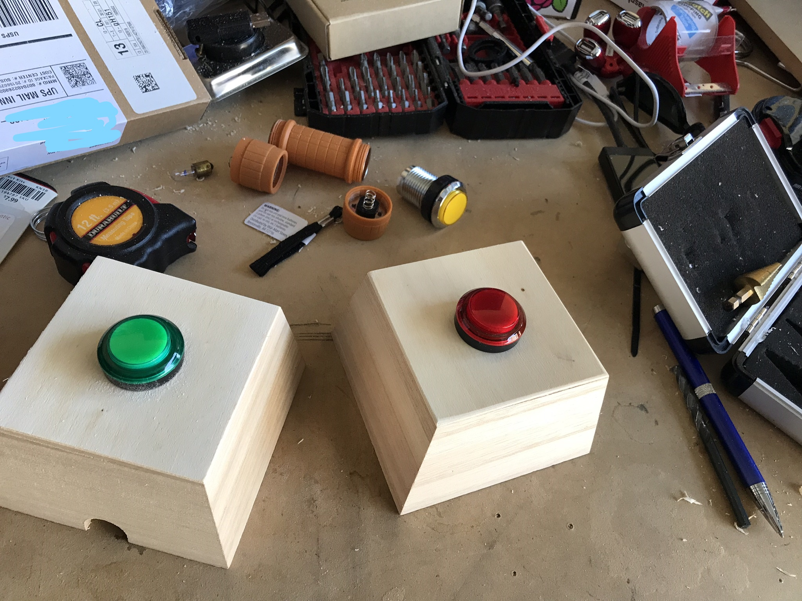
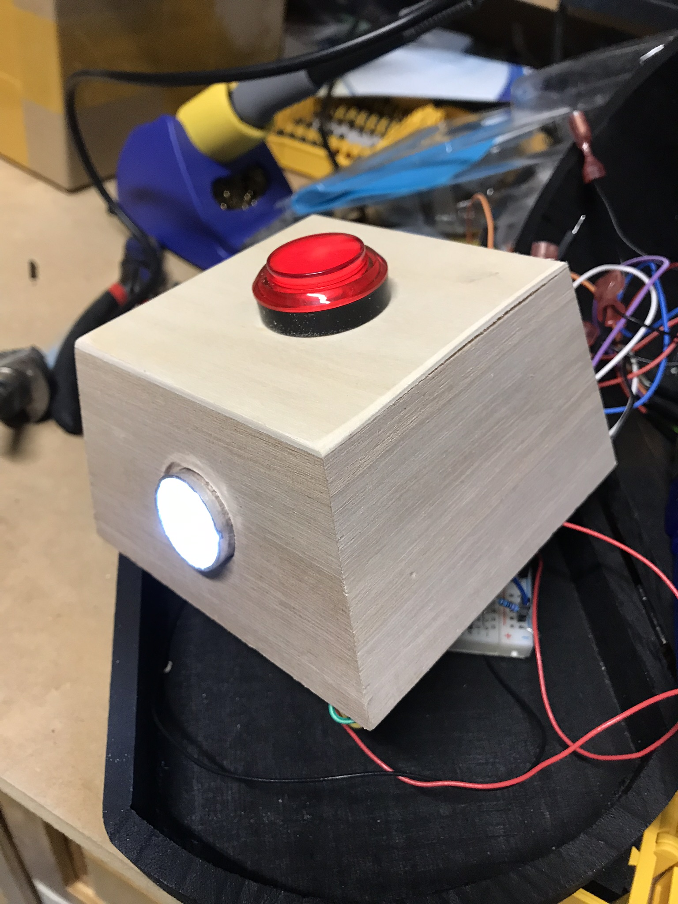
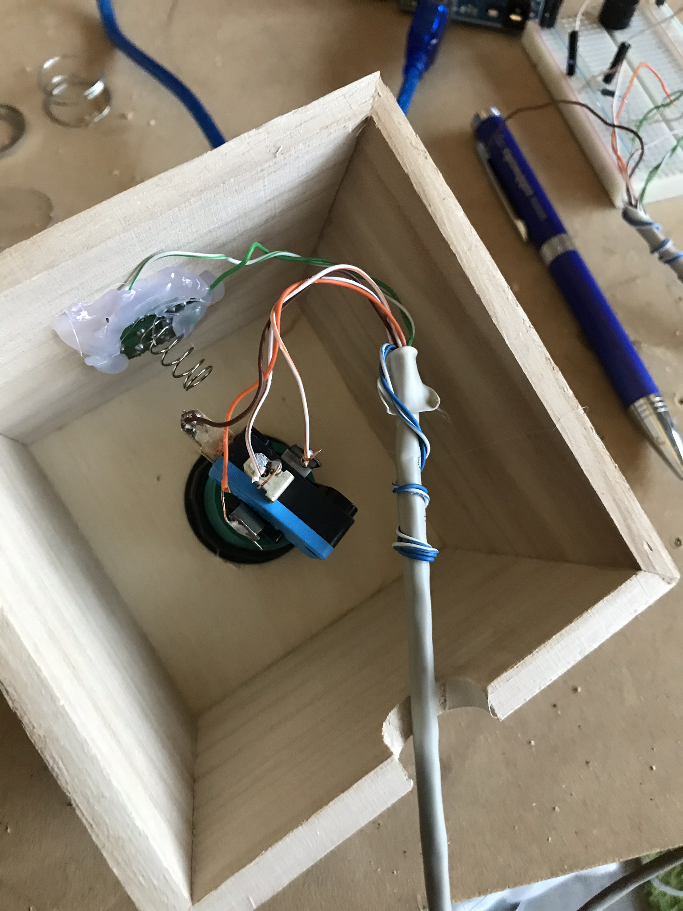
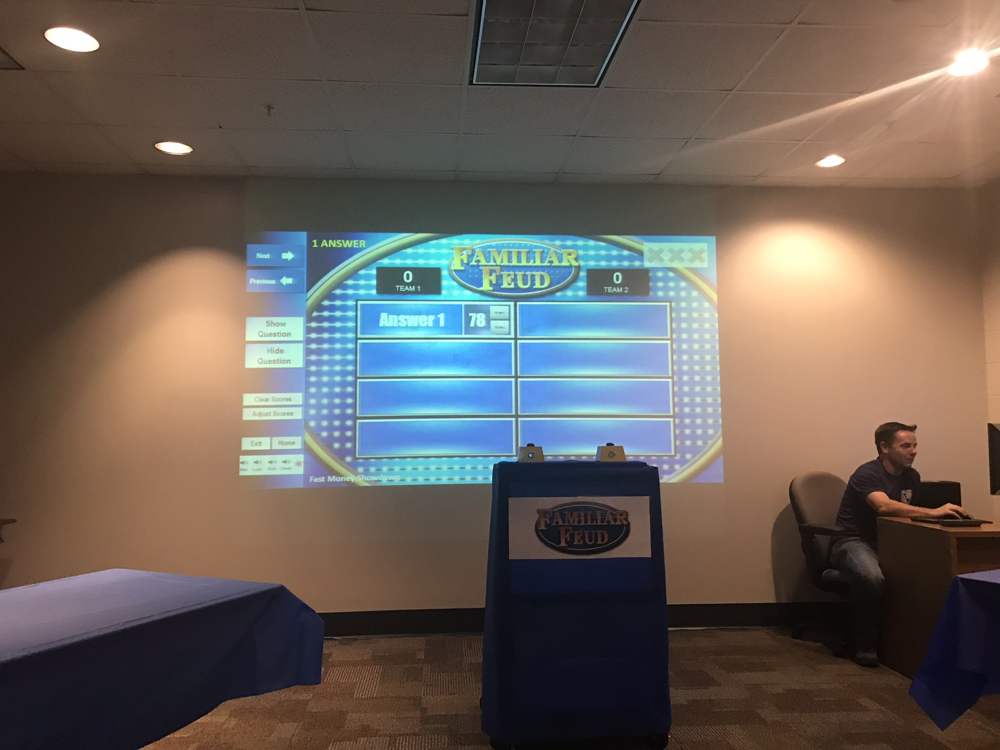

## Welcome to my game show button project!

With the help from hrttele over at instructable.com, I put together button boxes to use with a Family Fued type game. Most of the code stayed the same but we used only 2 lights/switches instead of 3.

```markdown
//define pins to be used
int S1 = 2; //switch 1
int S2 = 3;
int L1 = 7; // light 1
int L2 = 8;
int B = 12; // buzzer
void setup() { 
// initialize the digital pins.
// assume switches will wire from ground to input pins
pinMode(S1, INPUT_PULLUP);
pinMode(S2, INPUT_PULLUP);
pinMode(L1, OUTPUT); // if using leds please remember to use series resistors with them
pinMode(L2, OUTPUT);
pinMode(B, OUTPUT); // buzzer wired from output pin to ground 
}
void loop() {
if (!digitalRead(S1))
{ digitalWrite(L1,HIGH); // turn on lamp 1
digitalWrite(B,HIGH); // turn on buzzer
delay(500); // wait 2 seconds
digitalWrite(B,LOW); // turn off buffer
delay(5000); // wait 28 more seconds
digitalWrite(L1,LOW); // turn off lamp 1
}
if (!digitalRead(S2))
{ digitalWrite(L2,HIGH); // turn on lamp 2
digitalWrite(B,HIGH); // turn on buzzer
delay(500); // wait 2 seconds
digitalWrite(B,LOW); // turn off buffer
delay(5000); // wait 28 more seconds
digitalWrite(L2,LOW); // turn off lamp 2
}

}
```






<div class="myvideo">
   <video  style="display:block; width:100%; height:auto;" controls>
       <source src="{{ site.baseurl }}/IMG_2762.MP4" type="video/mp4" />
          </video>
</div>
